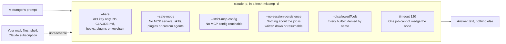
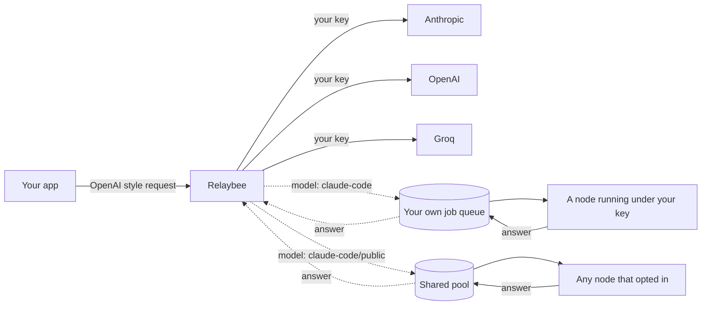

<p align="center">
  
</p>

<p align="center">
  One OpenAI-shaped endpoint. Bring your own provider keys, or let a supporter answer for you.<br>
  No signup. No database. Live at <a href="https://relaybee.vercel.app">relaybee.vercel.app</a>.
</p>

---

Relaybee is a small proxy. Point any OpenAI-compatible app at it and it forwards your chat
requests to a real provider. Your key is a signed token, and your provider credentials are
encrypted and handed back to you to keep. There is nothing on the server to leak and no account
to make.

There are two ways to get an answer, and you pick per request by the model name:

1. **Bring your own provider keys.** Add one or more for Anthropic, OpenAI, or Groq. Relaybee pools
   them and fails over when one is busy or dead.
2. **Use the `claude-code` model.** Your request goes to a supporter node running Claude Code or
   Codex under your own key, so a spare machine of yours answers your own calls with no provider key
   involved. Send `claude-code/public` instead and the job is offered to anyone who has opted a node
   into the shared pool, which is the version that reaches strangers.

<p align="center">
  
</p>

## Get started in 30 seconds

Open the site. A key is minted for you the moment the page loads, with no signup and nothing to
confirm. Copy it and paste it where your OpenAI key would go.

The [docs page](https://relaybee.vercel.app/docs.html) fills every example in with that key and
will run the first call for you, so you can check it works before writing any code. Adding your own
provider key is one more call, `POST /api/connect`, and the docs page has it ready to copy.

From code it is three lines of setup. Any OpenAI client works:

```js
import OpenAI from 'openai'

const relaybee = new OpenAI({
  baseURL: 'https://relaybee.vercel.app/api/v1',
  apiKey: process.env.RELAYBEE_KEY,
  defaultHeaders: { 'X-Relaybee-Connection': process.env.RELAYBEE_CONNECTIONS },
})

const res = await relaybee.chat.completions.create({
  model: 'anthropic/claude-opus-5',
  messages: [{ role: 'user', content: 'hi' }],
})
```

Models are named `provider/model`, like `anthropic/claude-opus-5`, `openai/gpt-4o`, or
`groq/llama-3.3-70b-versatile`. Use `claude-code` to go through the relay to a node of your own, or
`claude-code/public` to offer the job to anyone running a node in the shared pool.

For either, send `stream: true` if the answer might take a while. A node answering a real question
usually takes 20 to 30 seconds, and a buffered response has to give up before then because the
platform requires one to start within 25 seconds. Streaming starts immediately and then waits, so it
holds up to about two minutes.


## Become a supporter

You can run a node on your own machine that answers `claude-code` requests. By default those are
your own: a job goes to its requester's own queue, so a node polling under your key is only ever
offered jobs sent under that same key. Answering strangers is a separate opt-in, `{"pool":"public"}`
on the poll, and nothing turns it on for you. The whole setup is one line. Tell Claude Code or
Codex:

> Set up this machine as a Relaybee supporter node using the setup docs at
> https://relaybee.vercel.app/llms.txt. I have read and accepted the supporter terms on that page.
> Run the setup, then tell me the pid and the stop command.

It needs `ANTHROPIC_API_KEY` exported first. That is not incidental. Supporter nodes answer on API
billing and never on your Claude login, because a consumer seat is licensed to its holder for their
own use and answering strangers is the part it does not cover. `--bare` reads the API key and never
touches OAuth or the keychain, so a node cannot spend a Pro/Max seat even by accident. Cost is bounded at both ends: `--max-budget-usd` caps a single job, and the loop stops itself after
`MAXJOBS` jobs (100 by default, set `RELAYBEE_MAX_JOBS` to change it) so the total is finite too.

Claude reads [`/llms.txt`](https://relaybee.vercel.app/llms.txt), mints its own key, and leaves a
loop polling in the background. There is nothing to paste and no key to copy. That key is the one
thing worth understanding about this path: the node serves the queue of the key it minted, not the
key your browser holds, so it answers calls made with that key. To point a node at the key on the
homepage instead, use "Or paste the steps yourself" under Support, which runs the same loop on the
key the page already has. It is a one-minute
setup, not a job that occupies the session you ran it from. Under the hood the loop does this until
you stop it:

1. It long-polls `POST /api/work/next` for the next job on your own queue.
2. It answers the job's messages with a separate headless `claude -p`, not the session you set it
   up from. No caller's prompt is ever read into that session's context.
3. It sends the answer back with `POST /api/work/complete`, then polls again.

It needs `bash` and `jq`. On Windows that means Git Bash, which is what Claude Code's Bash tool
already uses, plus `winget install jqlang.jq`. Before reporting success it asks
`GET /api/work/status` whether the relay can actually see the node, because a pid proves nothing on
its own: a background shell that died a second later still leaves you one.

That wording is deliberate and was measured rather than guessed, against real headless agents
(`test/agent-harness.mts` boots the API and serves this repo's own `public/` so trials never touch
production). "Connect to … and fetch `/llms.txt` and follow it" was refused every time: it is the
shape of a prompt injection, so agents decline before reading anything. Describing the page as
setup docs got them to read it, and carrying your acceptance of the supporter terms is what stops
them stalling to ask a human who is not there mid-setup.

The site shows how many nodes are online, and turns green when your own is connected. Opt into the
public pool and it becomes a plaintext trust relationship: you can read the prompts you answer, and
those callers read your answers. (If your tool cannot fetch a URL, the supporter view also has the
full steps to paste by hand.)

### What the answering process can reach

A job from the public pool is a stranger's prompt going into an agent on your machine, so the
process that reads it is contained six ways, and the deny list is the weakest of them.



The deny list alone was not enough, and that was measured rather than assumed. The previous version
named fourteen tools, and on a stock install a caller's prompt still arrived holding `ToolSearch`,
`Skill`, `Workflow`, `ScheduleWakeup` and `ReportFindings`. Through `ToolSearch` it could load this
machine's own `mcp__claude_ai_Gmail__search_threads` and Google Calendar tools by name. A deny list
can only block what it names, and it cannot name a tool that did not exist when it was written.
`--safe-mode --strict-mcp-config` is what actually closes that, because it removes the surface
instead of enumerating it.

So the worker does not trust any of it on faith. Before it takes a single job it plants a canary
file, runs the exact command the loop will use, and refuses to start if the answer contains the
canary:

```
supporter start
  |
  +-- ANTHROPIC_API_KEY set? ------ no --> exit, tell the human why
  |                                yes
  +-- mint key, mktemp -d
  |
  +-- plant canary.txt, ask the sandboxed agent to read it
  |         |
  |         +-- canary came back --> REFUSING TO START
  |         +-- contained --------> poll for work
```

A deny list that has quietly gone stale looks identical to one that works, right up until a caller
finds the gap. This turns that into a loud refusal at startup instead.

## How it works

Two ideas keep it simple:

- Your Relaybee key is a signed token. Checking it is one hash, so there is no user table and no
  lookup.
- Your provider key is sealed into an encrypted blob that only your key can open. Relaybee keeps no
  copy, so there is nothing on the server to leak.

The relay adds one stateful piece: a job queue, and there is one per requester. A `claude-code`
request is parked on the caller's own queue, where only a node holding that same key can take it.
`claude-code/public` parks it on the shared queue that opted-in nodes also watch. Either way a node
long-polls, answers, and the answer is handed back to the original caller.



For a fuller tour of the design, see [docs/ARCHITECTURE.md](docs/ARCHITECTURE.md).

## Endpoints

| Method | Path | What it does |
| --- | --- | --- |
| POST | `/api/keys/issue` | Make a Relaybee key |
| POST | `/api/connect` | Seal a provider key into a blob you keep |
| POST | `/api/v1/chat/completions` | The proxy, OpenAI compatible, streaming supported |
| GET | `/api/v1/models` | List callable models, and the providers you can route to |
| POST | `/api/work/next` | Supporter: ask for the next job |
| POST | `/api/work/complete` | Supporter: send back an answer, with the ticket the poll issued |
| GET | `/api/work/status` | Is a node of your own online, and how many are online in total |
| GET | `/api/health` | Liveness |

## Honest limits

- Reaching a stranger is opt-in on both ends: the caller sends `claude-code/public` and the node
  polls with `{"pool":"public"}`. When both do, that supporter can read the prompts they answer and
  the caller can read their answer. The relay is a trust relationship there, and `/llms.txt` says
  so, which is the file a supporter's agent reads and follows before it runs anything.
- The relay uses an in-memory queue unless Upstash is set, so on the free tier a caller and a
  supporter only meet if they land on the same server. Set `UPSTASH_REDIS_REST_URL` and
  `UPSTASH_REDIS_REST_TOKEN` to make it work everywhere.
- A lost key cannot be shown again, and nothing on the server can look it up. Copy it when you mint
  it. The browser remembers it, so a cleared site storage is a lost key.
- This is a demo. The free hosting tier is not for commercial use.

## Local development

```bash
npm install
npm run check   # typecheck and the smoke test suite
```

There are no runtime dependencies. Everything runs on the edge with plain fetch and WebCrypto.
