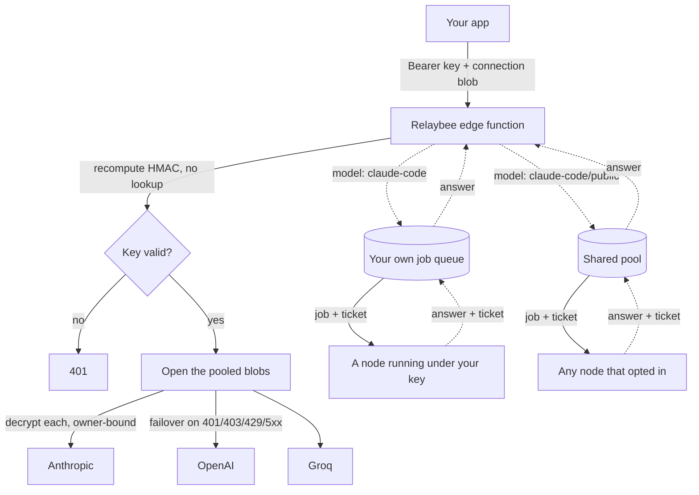

# Architecture

Relaybee is one OpenAI-shaped endpoint with no database on the request path. This
is a short tour of the four pieces that make that work.

## Stateless HMAC key

A Relaybee key is not a row in a table. It is a small payload (a user id, a tier,
an expiry) plus an HMAC signature over that payload, computed with a server-held
master secret. The key carries everything it asserts about itself.

Checking a key is one recompute. The server re-signs the payload and compares it
to the signature the key already carries. If they match, the key is genuine and
unexpired; if they do not, it is rejected. There is no user table, no lookup, and
no read of any shared state. Minting is free and unauthenticated because a key
grants nothing on its own. It routes traffic only once a sealed provider key
rides along with it, and on the relay side it is the name of your queue, so a
fresh key polls for its own jobs and sees nobody else's.

The cost of this is honest: a key stays valid until it expires, because there is
nowhere to write a revocation. That tradeoff is deliberate and recorded in
PROJECT.md.

## AES-GCM sealed connection, bound to the owner

Your provider credential never rests on the server. When you connect a provider
key, Relaybee encrypts it with AES-256-GCM under a master encryption key and hands
the sealed blob back to you. Your browser keeps it. Relaybee keeps no copy, so
there is nothing on the server to leak.

The seal binds the blob to you. Your Relaybee user id goes in as the AES-GCM
additional authenticated data, so decryption only succeeds when the same owner
presents the blob. A blob scraped from someone else's browser fails to open and
cannot spend their credits. This owner-binding is security-reviewed and is never
to be removed.

## Pooling proxy with failover

You can attach more than one sealed blob to a single request. Relaybee treats them
as a pool. It opens each blob, tries the provider, and on a retryable failure
(401, 403, 429, or a 5xx) walks on to the next one. The first working provider
answers.

The walk starts at a random offset rather than at the first blob, so traffic
spreads across the pool instead of hammering whichever key sits at index zero.
The pool is capped at eight blobs, which bounds how many upstream calls one
request can trigger. Every response carries a health header reporting each
attempt's outcome in walk order, so you can see which key answered and which
were skipped.

## Supporter relay: a queue per caller, plus an opt-in pool

The `claude-code` model does not go to a provider. It goes to a person's
machine, and by default only to one running under the caller's own key.

There is one queue per requester, keyed on the caller's user id. A `claude-code`
request is parked on the caller's own queue and waits, up to a bounded window,
for an answer. On the other side, a supporter runs a small worker loop on their
own machine: it long-polls `/api/work/next` for the next job, answers the
conversation, posts the answer back, and polls again. A node polls with an
ordinary Relaybee key, and what that key hands it is the jobs filed under that
same key, so its own queue is the whole of its access. The answer flows back to
the waiting caller, shaped like an ordinary OpenAI completion.

`claude-code/public` is the way out of that. It parks the job on one shared pool
instead, which a node joins by sending `{"pool":"public"}` as the body of its
poll. Both halves are named on purpose. There used to be a single global list,
so anyone could mint a free key at the unauthenticated issue endpoint, long-poll
it, and be handed any caller's prompt in plaintext. Reading a stranger's prompt
and writing a stranger's answer are things to agree to, not to inherit.

Delivery is gated on a ticket rather than on the job id. `/api/work/next` returns
the job with an HMAC over that job id and the polling node's user id, and
`/api/work/complete` will not take an answer without it. The id was never proof
of assignment: Relaybee publishes it to the caller as `chatcmpl-<id>`, so it
leaks by design. The ticket is checked by recomputing it under the same master
secret that signs keys, which costs no storage and no extra queue command, and
another key cannot replay it because the user id of the key that took the job is
inside the signature.

Presence is recorded per pool. A node marks itself live as it polls, and a node
that opted in marks itself in a second set as well, so the question "is anyone
there" is answered from the set that matches the job: a plain `claude-code`
caller against their own node, a `/public` caller against the opt-in count. One
count for both could only say yes on the strength of some unrelated node, and
hold a public caller for the whole streaming window on it.

The queue is the only stateful piece in the system. It uses Upstash Redis when
those environment variables are set, and a per-instance in-memory map otherwise.
Jobs carry only the model and the flattened messages, never the requester's id
or IP: the identity is in the queue's name, which the node never sees.

The relay is a disclosed plaintext-trust relationship. On your own queue both
ends are you. In the shared pool they are not: a supporter can read the prompt
they answer, and a caller can read the answer that comes back. The site says so
where a supporter turns it on, and we do not pretend otherwise.
